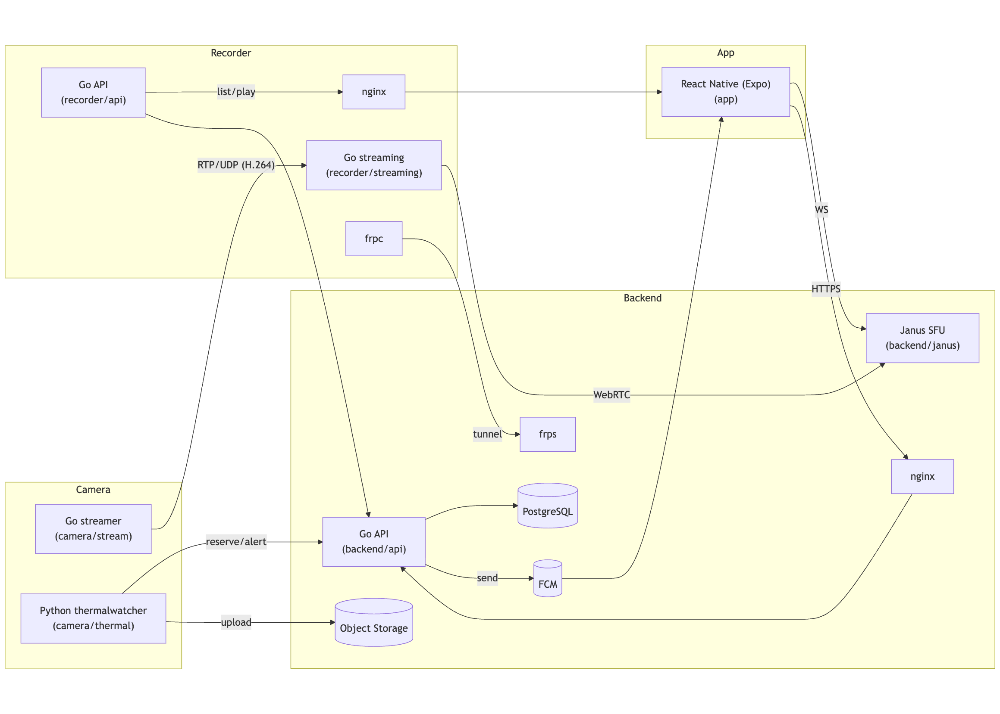

# 映像 × サーモ監視 NVR プロトタイプ

> 本リポジトリは、**カメラ → レコーダー → モバイルアプリ**のライブ視聴・録画と、**サーモカメラによる異常発熱検知 → プッシュ通知**を備えたプロトタイプです。  
> 掲載している一部コードは**過去、個人的に依頼を受けたプロジェクトのプロトタイプ**を、**許可を得たうえで再掲**しています。**機密情報・固有名詞・ドメイン名・鍵等はダミー値に置換・削除**しており、設計が伝わる最小限の形で公開しています。

---

## 全体像

-   **Camera（カメラ側）**

    -   `camera/stream`（Go）: H.264 を **GStreamer** でエンコードし **RTP/UDP** 配信（昼夜ソース切替）。
    -   `camera/thermal`（Python）: **UVC サーモカメラ**（例: FLIR Lepton）から温度データを取得し異常発熱を検知。画像をアップロードし、**FCM 経由プッシュ通知**を発火。

-   **Recorder（レコーダー側）**

    -   `recorder/streaming`（Go）: 受信した RTP を取り込み **Janus VideoRoom / WebRTC** へブリッジ、同時に**セグメント録画**。
    -   `recorder/api`（Go）: 録画リスト／再生用の **REST API**。

-   **Backend（中継・共通基盤）**

    -   `backend/api`（Go + Gin）: 認証・デバイス/トークン管理、**アラート通知**、**GCS 署名 URL**の発行など。
    -   `backend/janus` / `backend/nginx` / `backend/frps`: **Janus SFU**、リバースプロキシ、**FRP サーバ**。`docker-compose.yml` で一括起動。

-   **App（視聴アプリ）**
    -   `app`（React Native + Expo）: **Janus/WebRTC** でライブ視聴、録画再生、プッシュ通知の受信。

### データフロー

## 

## フォルダ構成（実体）

```
app/                          # React Native (Expo) アプリ
  App.tsx
  src/
    hooks/useJanus.ts
    lib/JanusSignalingClient.ts
    screens/(LiveViewScreen|RecListScreen|PlayRecordScreen|LoginScreen|CameraDetailScreen)/...

  assets/...
  package.json, tsconfig.json, app.json, yarn.lock

backend/                      # 中継・共通基盤（API/Janus/nginx/FRP）
  api/
    main.go
    handlers/(alerts|devices|recordings|auth...).go
    models/(alert|device|user...).go
    middleware/auth.go
    utils/notifications/(fcm|thermal).go
    utils/storage/(gcs|func).go
    utils/(db|jwt).go
    config/config.go
    go.mod, go.sum, Dockerfile
  janus/
    Dockerfile, conf/..., README.md
  nginx/
    Dockerfile, nginx.conf, conf.d/
  frps/
    Dockerfile, frps, frps.toml, LICENSE
  docker-compose.yml
  tables.sql                  # サンプルDB定義
  atras.md             # dbマイグレーション

camera/
  stream/                     # Go + GStreamer で H.264 RTP 送出
    main.go
    streamer/(pipeline|run|switcher).go
    scheduler/time_window.go
    config/config.go
    .env_sample
    go.mod, go.sum
  thermal/                    # サーモ監視 & 通知 (Python)
    main.py
    src/(controller|detector|uploader|renderer|spooler|uvc|utils|log|alert)/...
    systemd/thermalwatcher.service
    requirements.txt
    .env.sample
    setup.md

recorder/
  api/                        # 録画API (Go)
    main.go
    handlers/records.go
    records/(model|service|errors).go
    config/config.go
    *_test.go, go.mod, go.sum
  streaming/                  # RTP取り込み→Janus/WebRTC中継 & セグメント録画 (Go)
    cmd/main.go
    internal/(pipeline|probe|retry|webrtc).go
    config/config.go, config.yaml
    go.mod, go.sum
```

---

## 各フォルダについて

### App（`app/`）

-   Expo ベース。`src/hooks/useJanus.ts` と `src/lib/JanusSignalingClient.ts` で **Janus** に接続。
-   画面: `LiveViewScreen/`, `RecListScreen/`, `PlayRecordScreen/`, `LoginScreen/`, `CameraDetailScreen/`。

### Backend（`backend/`）

-   **Gin** による API。JWT 認証、デバイス・ユーザ管理、**/alerts**・**/push_token**・**/devices** 等のエンドポイント。
-   `utils/notifications/` で **FCM**、`utils/storage/` で **GCS 署名 URL**を発行。
-   `docker-compose.yml` に **api / janus / nginx / frps** が含まれます。
-   主な環境変数（`api/config/config.go` 参照）:
    -   `POSTGRES_DSN`（PostgreSQL DSN）
    -   `JWT_SECRET`（JWT 秘密鍵）
    -   `JANUS_WS`（Janus WS URL）
    -   `GOOGLE_CRED_PATH`（GCP 認証 JSON）
    -   `API_PORT`（デフォルト 8080）

### Camera Streamer（`camera/stream/`）

-   Rockchip で **`mpph264enc`** を用い **H.264 + RTP/UDP** 送出。
-   **昼夜ソース自動切替**（`scheduler/time_window.go`, `streamer/switcher.go`）。
-   `.env_sample` に設定例あり:
    -   `UDP_HOST`, `UDP_PORT`, `WIDTH`, `HEIGHT`, `FPS`, `BITRATE`
    -   `NORMAL_CAMERA_PATH`, `NIGHT_CAMERA_PATH`, `TZ`, `NIGHT_VISION_TIME`, `SWITCH_EVERY_SEC`

### Thermal Watcher（`camera/thermal/`）

-   **UVC サーモカメラ**から放射温度を取得し、`src/detector/detector.py` の **絶対温度/差分**しきい値で異常検知。
-   画像をローカル退避（`src/spooler/spooler.py`）→ **署名 URL でアップロード** → **/alerts** で通知。
-   `systemd/thermalwatcher.service` を同梱（常駐運用向け）。
-   `.env.sample` 主要キー:
    -   画像/温度: `FRAME_W`, `FRAME_H`, `FPS`, `FFC_INTERVAL_SEC`
    -   検知: `ABS_THRESH_C`（ほか差分しきい値等もあり）
    -   通信（例）: `UPLOADS_API_URL`, `ALERTS_API_URL`, `DEVICE_ID`
    -   退避/再送: `SPOOL_DIR`, `MAX_SPOOL_BYTES`, `RECONNECT_MAX_SEC`
    -   ログ: `LOG_FILE`, `LOG_LEVEL`

### Recorder Streaming（`recorder/streaming/`）

-   **udpsrc → Janus/WebRTC → splitmuxsink** でセグメント録画。
-   `internal/webrtc.go` に Janus/pion 連携、`internal/pipeline.go` に **GStreamer** パイプライン。
-   `config.yaml` で録画先やポート等を定義。

### Recorder API（`recorder/api/`）

-   録画一覧・詳細のエンドポイント（`handlers/records.go`）。
-   環境変数（`config/config.go`）:
    -   `BASE_PATH`（録画ファイル保存先）
    -   `BASE_URL`（再生 URL のベース）
    -   `LISTEN_ADDRESS`（バインドアドレス）

---

## 環境構築・実行

> 別途 STUN/TURN やカメラを動かす OS 上での設定が必要です。以下は**検証用**の最小手順です。また、このリポジトリでは、名称や機密情報を削除・変更しているため、そのままでは動作しない状態となっています。参考としてご覧ください。

1. **Backend を起動（Docker）**

```bash
cd backend
docker compose up -d --build
```

2. **Recorder を起動**

-   Streaming:
    ```bash
    cd recorder/streaming
    # config.yaml を編集（受信ポート/録画ディレクトリ 等）
    go run ./cmd/main.go
    ```
-   API:
    ```bash
    cd recorder/api
    export BASE_PATH=/var/records
    export BASE_URL=https://example.com/records
    export LISTEN_ADDRESS=0.0.0.0:8081
    go run ./...
    ```
-   その他:
    FRP と nginx を起動する必要があります（手順は省略）。

3. **Camera を起動**

-   H.264 送出（Go）:
    ```bash
    cd camera/stream
    cp .env_sample .env   # UDP_HOST/PORT, カメラデバイス等を設定
    go run ./...
    ```
-   Thermal 監視（Python）:
    ```bash
    cd camera/thermal
    python3 -m venv .venv && source .venv/bin/activate
    pip install -r requirements.txt
    cp .env.sample .env   # APIエンドポイント等を設定
    python main.py
    ```

4. **App を起動（Expo）**

-   WebRTC を扱うために、ネイティブビルドが必要なモジュールを使用しています。expo-dev-client をビルドした後、実機やシミュレータにインストールする必要があります。

---

## 注意事項

-   **クライアント名・ドメイン名・ホスト名**はダミーです。実在の情報は削除または置換済みです。
-   機密情報を削除した際コードに変更を加えているため、このままの状態では完全な動作は行うことができません。参考としてご覧ください。
-   `frps` / `janus` / `nginx` 等の**サードパーティライブラリ**は各ディレクトリの **LICENSE** や公式ライセンスに従います。

---

## 技術スタック

-   **Mobile**: React Native (Expo), TypeScript
-   **Media**: GStreamer, mpph264enc (Rockchip), RTP/UDP, Janus VideoRoom, WebRTC (pion)
-   **Backend**: Go (Gin), PostgreSQL, Firebase Admin/FCM, Google Cloud Storage（署名 URL）
-   **Infra**: Docker / docker-compose, nginx, FRP (frps/frpc)
-   **Ops**: systemd（thermalwatcher 常駐）

---

## ライセンス / 権利表記

-   自作コードの著作権は作者に帰属します。
-   業務委託成果物由来のコードは、**掲載許可の範囲**で再掲しています。
-   第三者ライブラリ/バイナリは各ライセンスに従います（FRP, Janus, nginx ほか）。
